# Churn Prediction in Telecommunication Industry

***

# 1. Business Context Overview

Churn prediction is the process of analyzing customer data to detect customers who are more likely to cancel their subscriptions. Most of the large subscription businesses conduct their own form of churn prediction analysis to identify customers most at-risk of churning, and, if properly harnessed, it leads to huge business savings and improved customer lifetime value (LTV). 

According to Marketing Metrics, the probability of selling to an existing customer lies between 60-70 %  which distinctly exceeds that of selling to a brand-new customer, which on the other hand is only around 5-20%. Therefore, having the ability to accurately predict future churn rates plays a critical rule in business sustainability as it provides a better understanding of customer behavior, consequently future expected revenue. 

Given such importance, I use customer data availabe at https://www.kaggle.com/blastchar/telco-customer-churn to address this business-related basis by performing exploratory data analysis in order to detect assocciations among different factors along with extracting meaningful insights that matter most to predictive churn analysis. 

## 1.1 Data set content:
Each row represents a customer, each column contains customer’s attributes described on the column Metadata.

The data set includes information about:

- Customers who left within the last month – the column is called Churn
- Services that each customer has signed up for – phone, multiple lines, internet, online security, online backup, device protection, tech support, and streaming TV and movies
- Customer account information – how long they’ve been a customer, contract, payment method, paperless billing, monthly charges, and total charges
- Demographic info about customers – gender, age range, and if they have partners and dependents

# 2. Analysis Summary
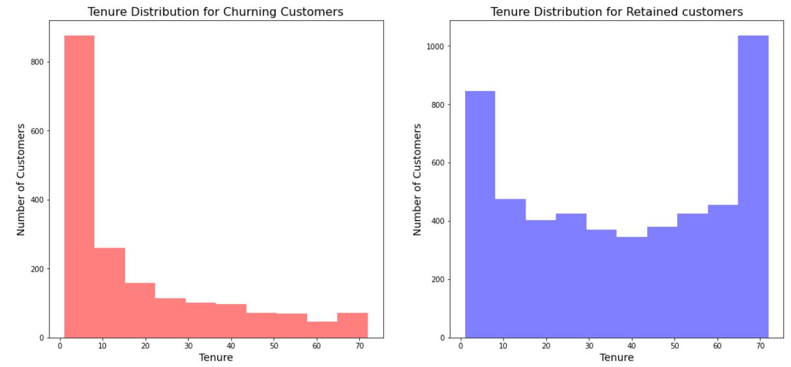 
**2.1 Histogram of Tenure of the customers who churned away and who continued showed that the customers with shorter tenure are more likely to churn away.**
**We can present these plots more intuitively using Kernel Density Estimate Plot**

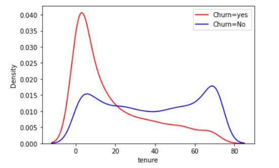

**2.2 Retention rate appears to increase with the increase in a customer's tenure**

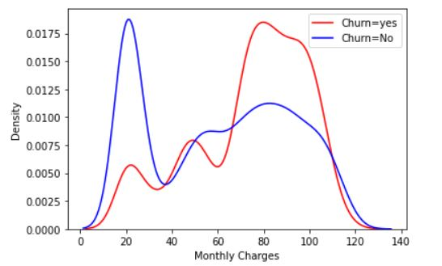

**2.3 with the increase in monthly charges, customers tend to churn away**

 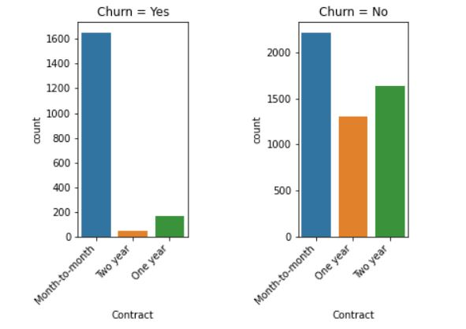

**2.4 The proportion of Month-to-Month contract is distinctly high among the customers who have churned away, implying the strong association of churn rate with contract lenght**

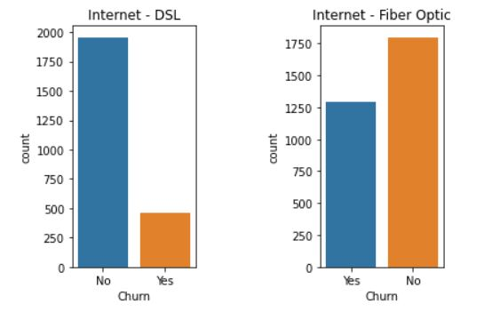   
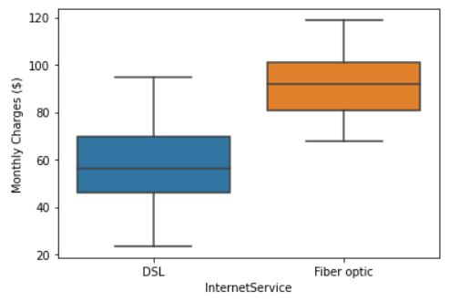

**2.5 The marked variation in churn rate based on the internet service type, along with the plain difference in charges (minimum charges for Fiber optics service lies slightly higher than the median value of DSL service) supports the earlier mentioned point of monthly charges' impact on Churn rate**

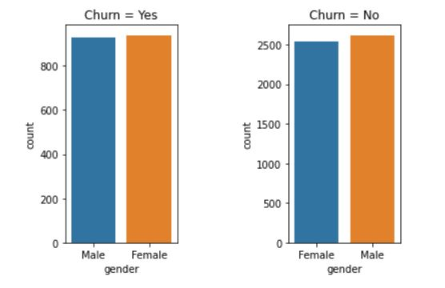

**2.6 we can see that gender has almost no impact on churn rate**

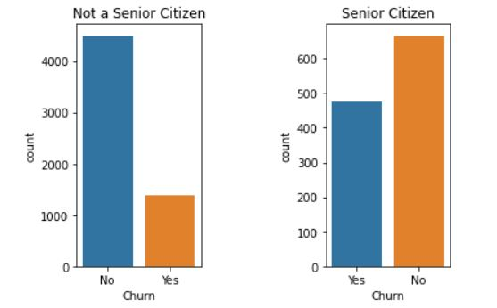    
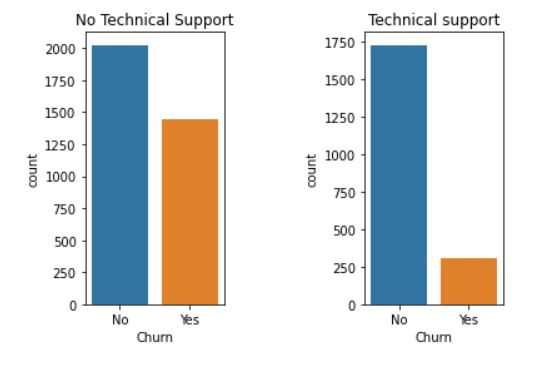

**2.7 Unlike gender, seniority and technical support appears to have strong association with churn rate**

***
# 3. Predictive Modeling and Model Selection

It gets crucially essential to fully grasp the business objective as it invokes further concern beyond the overall accuracy of the model. The selection process is driven by the worst case scenario, which is not being able to identify the customer who are more inclined to discontinue. Sensitivity (the ability of the classifier to correctly label as positive a sample that is actaully positive) in that sense, is both more relevant and significant than specificity (the ability of the classifier to correctly label as negative a sample that is actaully negative). in other words, false positives are more acceptable than false negatives. 

In the case at hand, logistic regression is superior to other models in terms of both accuracy and sensitivity; thus, we will select logistic regression model on similar datasets to predict whether a customer is about to churn away or not.

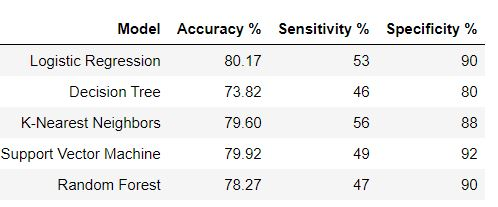    

In the absence of logistic regression, we would have preferred KNN to kernel support vector classifier, though SVC has better accuracy – because KNN model has better sensitivity. Moreover, we can adjust probability threshold to increase sensitivity at the expense of specificity. However, in our pursuit of higher sensitivity, it is crucial to take specificity in consideration (ability to identify true negatives). Poor specificity can lead to expenditure on attempts to retain the customers we would have retained them otherwise (this is the impact of false positives). At what point does the marketing/product teams start focusing on sensitivity is a managerial decision, which will primarily be driven by budget allocation.

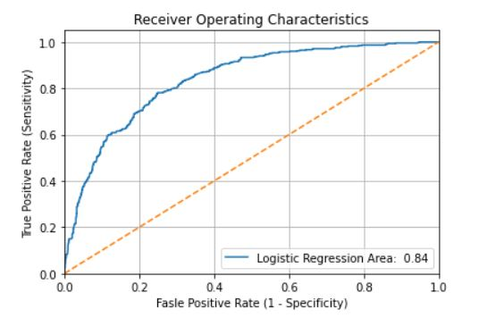    

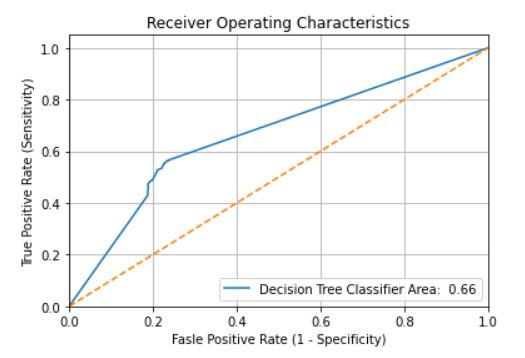    

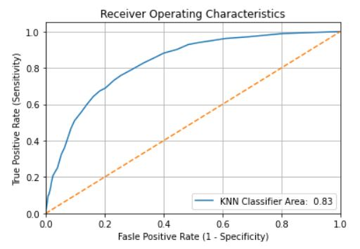    

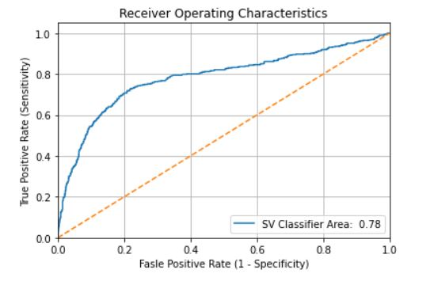    

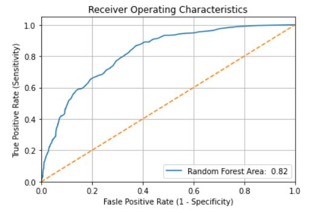    

Both Sensitivity and Specificity are dependent on the proportion of positive and negative samples in our prediction process which raises an issue as the model tends to be biased towards the more frequently predicted class. However, in order to address such a problem, we use Reciever operating characterictic curve which measures the performace of a binary classifier as its discrimination threshold is varied along with area under curve(optimal value at AUC equals 1) which is still useful even with high class imbalance unlike overall accuracy. 

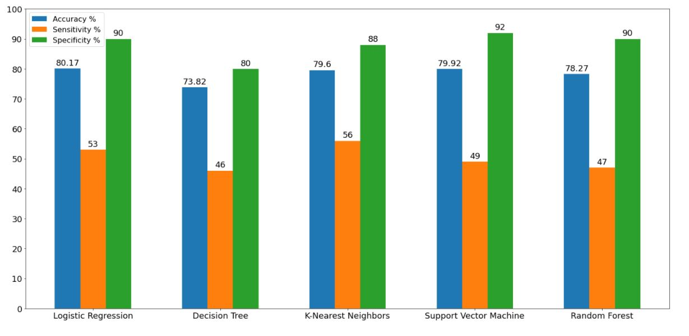    
